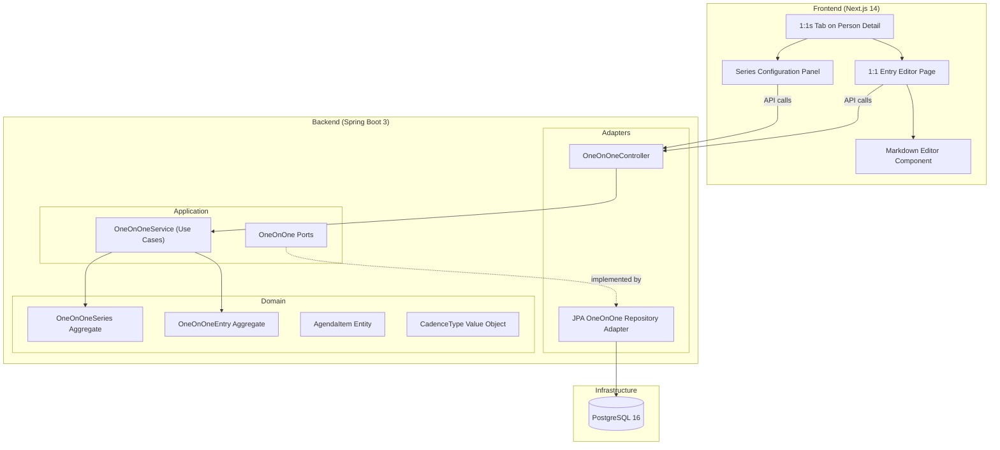
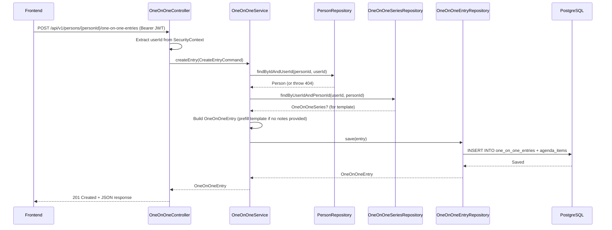
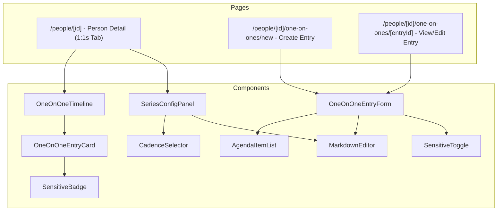

# Design Document: 1:1 Entry Management

## Overview

The 1:1 Entry Management feature enables managers to configure recurring meeting cadences, create structured 1:1 entries with Markdown notes, track agenda items, and record outcomes — all scoped to the owning manager. This is the core workflow of CrewCaptain: "Run better 1:1s faster."

Key design goals:
- **Structured capture**: Agenda items (checkboxes) + freeform Markdown notes + outcomes
- **Cadence awareness**: Per-person series configuration drives "stale 1:1" detection (future notifications)
- **Template support**: Per-person Markdown templates prefill new entries for consistent structure
- **Sensitive content**: Flag entries as sensitive with UI-level hide/show toggle
- **Data isolation**: Every query scoped by `userId` — a manager can never access another manager's 1:1 data
- **Person-scoped**: All entries are nested under a Person, maintaining the person-centric navigation model

## Architecture

### High-Level Component Interaction



### Request Flow — Create 1:1 Entry



## Components and Interfaces

### Domain Layer

#### Aggregates

**OneOnOneSeries** (Aggregate Root)
- Represents the cadence configuration for a manager's 1:1s with a specific person
- One series per (userId, personId) combination
- Contains the Markdown template for prefilling new entries

**OneOnOneEntry** (Aggregate Root)
- Represents a single 1:1 meeting record
- Owns its agenda items (entities within the aggregate)
- Enforces invariants: meetingDate must not be null, agenda item text must be non-empty

#### Value Objects

| Value Object | Fields | Constraints |
|---|---|---|
| `OneOnOneSeriesId` | `value: UUID` | Non-null |
| `OneOnOneEntryId` | `value: UUID` | Non-null |
| `AgendaItemId` | `value: UUID` | Non-null |
| `CadenceType` | enum: `WEEKLY, BIWEEKLY, MONTHLY, CUSTOM` | Restricted values |

#### Domain Entities

**AgendaItem** (Entity within OneOnOneEntry aggregate)
- `id: AgendaItemId`
- `text: String` (non-empty)
- `checked: Boolean` (default: false)
- `displayOrder: Int`
- `createdAt: Instant`

### Application Layer

#### Use Cases (Commands)

| Use Case | Input | Output | Description |
|---|---|---|---|
| `UpsertOneOnOneSeriesUseCase` | `UpsertSeriesCommand(userId, personId, cadenceType, customIntervalDays?, templateMarkdown?)` | `OneOnOneSeries` | Creates or updates the 1:1 series for a person |
| `CreateOneOnOneEntryUseCase` | `CreateEntryCommand(userId, personId, meetingDate, agendaItems?, notesMarkdown?, outcomesMarkdown?, sensitive?)` | `OneOnOneEntry` | Creates a new 1:1 entry |
| `UpdateOneOnOneEntryUseCase` | `UpdateEntryCommand(userId, personId, entryId, meetingDate?, agendaItems?, notesMarkdown?, outcomesMarkdown?, sensitive?)` | `OneOnOneEntry` | Updates an existing entry |
| `DeleteOneOnOneEntryUseCase` | `DeleteEntryCommand(userId, personId, entryId)` | `Unit` | Deletes an entry |

#### Use Cases (Queries)

| Use Case | Input | Output | Description |
|---|---|---|---|
| `GetOneOnOneSeriesUseCase` | `GetSeriesQuery(userId, personId)` | `OneOnOneSeries?` | Retrieves the series config |
| `GetOneOnOneEntryUseCase` | `GetEntryQuery(userId, personId, entryId)` | `OneOnOneEntry` | Retrieves a single entry |
| `ListOneOnOneEntriesUseCase` | `ListEntriesQuery(userId, personId, page, size)` | `Page<OneOnOneEntry>` | Lists entries with pagination |
| `GetLastOneOnOneDateUseCase` | `GetLastDateQuery(userId, personId)` | `Instant?` | Gets the most recent meeting date for at-a-glance |

#### Ports (Interfaces)

```kotlin
// Outbound port — defined in application layer, implemented by persistence adapter
interface OneOnOneSeriesRepository {
    fun findByUserIdAndPersonId(userId: UserId, personId: PersonId): OneOnOneSeries?
    fun save(series: OneOnOneSeries): OneOnOneSeries
}

interface OneOnOneEntryRepository {
    fun save(entry: OneOnOneEntry): OneOnOneEntry
    fun findByIdAndUserIdAndPersonId(entryId: OneOnOneEntryId, userId: UserId, personId: PersonId): OneOnOneEntry?
    fun findAllByUserIdAndPersonId(userId: UserId, personId: PersonId, pageable: Pageable): Page<OneOnOneEntry>
    fun deleteByIdAndUserIdAndPersonId(entryId: OneOnOneEntryId, userId: UserId, personId: PersonId): Boolean
    fun findLatestMeetingDate(userId: UserId, personId: PersonId): Instant?
}
```

```kotlin
// Inbound port — defined in application layer, called by web adapter
interface OneOnOneCommandPort {
    fun upsertSeries(command: UpsertSeriesCommand): OneOnOneSeries
    fun createEntry(command: CreateEntryCommand): OneOnOneEntry
    fun updateEntry(command: UpdateEntryCommand): OneOnOneEntry
    fun deleteEntry(command: DeleteEntryCommand)
}

interface OneOnOneQueryPort {
    fun getSeries(query: GetSeriesQuery): OneOnOneSeries?
    fun getEntry(query: GetEntryQuery): OneOnOneEntry
    fun listEntries(query: ListEntriesQuery): Page<OneOnOneEntry>
    fun getLastOneOnOneDate(query: GetLastDateQuery): Instant?
}
```

### Adapter Layer

#### Web Adapter (REST Controller)

**OneOnOneController** — handles all `/api/v1/persons/{personId}/one-on-one-*` endpoints
- Extracts `userId` from the security context
- Validates `personId` path parameter
- Delegates to use case ports
- Maps domain objects to response DTOs

#### Persistence Adapter

**JpaOneOnOneSeriesRepository** — implements `OneOnOneSeriesRepository` port
- Maps between domain `OneOnOneSeries` and JPA `OneOnOneSeriesEntity`
- Unique constraint on (user_id, person_id)

**JpaOneOnOneEntryRepository** — implements `OneOnOneEntryRepository` port
- Maps between domain `OneOnOneEntry` and JPA `OneOnOneEntryEntity`
- Manages cascade to `AgendaItemEntity`
- All queries include `userId` in WHERE clause
- Default sort: meetingDate DESC

### Frontend Components



## Data Models

### Domain Model

```kotlin
enum class CadenceType {
    WEEKLY, BIWEEKLY, MONTHLY, CUSTOM
}

data class OneOnOneSeries(
    val id: OneOnOneSeriesId,
    val userId: UserId,
    val personId: PersonId,
    val cadenceType: CadenceType,
    val customIntervalDays: Int?,
    val templateMarkdown: String?,
    val createdAt: Instant,
    val updatedAt: Instant
) {
    init {
        if (cadenceType == CadenceType.CUSTOM) {
            require(customIntervalDays != null && customIntervalDays > 0) {
                "Custom cadence requires a positive interval in days"
            }
        }
    }
}

data class OneOnOneEntry(
    val id: OneOnOneEntryId,
    val userId: UserId,
    val personId: PersonId,
    val meetingDate: Instant,
    val agendaItems: List<AgendaItem>,
    val notesMarkdown: String?,
    val outcomesMarkdown: String?,
    val sensitive: Boolean,
    val createdAt: Instant,
    val updatedAt: Instant
) {
    init {
        agendaItems.forEach { item ->
            require(item.text.isNotBlank()) { "Agenda item text must not be blank" }
        }
    }

    fun updateNotes(notes: String?): OneOnOneEntry =
        copy(notesMarkdown = notes, updatedAt = Instant.now())

    fun updateOutcomes(outcomes: String?): OneOnOneEntry =
        copy(outcomesMarkdown = outcomes, updatedAt = Instant.now())

    fun toggleSensitive(): OneOnOneEntry =
        copy(sensitive = !sensitive, updatedAt = Instant.now())

    fun updateAgendaItems(items: List<AgendaItem>): OneOnOneEntry =
        copy(agendaItems = items, updatedAt = Instant.now())
}

data class AgendaItem(
    val id: AgendaItemId,
    val text: String,
    val checked: Boolean = false,
    val displayOrder: Int,
    val createdAt: Instant
) {
    init {
        require(text.isNotBlank()) { "Agenda item text must not be blank" }
    }
}
```

### Database Schema

```sql
-- V20250508120003__create_one_on_one_series_table.sql
CREATE TABLE one_on_one_series (
    id UUID PRIMARY KEY DEFAULT gen_random_uuid(),
    user_id UUID NOT NULL REFERENCES users(id) ON DELETE CASCADE,
    person_id UUID NOT NULL REFERENCES persons(id) ON DELETE CASCADE,
    cadence_type VARCHAR(20) NOT NULL,
    custom_interval_days INTEGER,
    template_markdown TEXT,
    created_at TIMESTAMP WITH TIME ZONE NOT NULL DEFAULT NOW(),
    updated_at TIMESTAMP WITH TIME ZONE NOT NULL DEFAULT NOW(),
    CONSTRAINT uq_one_on_one_series_user_person UNIQUE (user_id, person_id)
);

CREATE INDEX idx_one_on_one_series_user_person ON one_on_one_series(user_id, person_id);

-- V20250508120004__create_one_on_one_entries_table.sql
CREATE TABLE one_on_one_entries (
    id UUID PRIMARY KEY DEFAULT gen_random_uuid(),
    user_id UUID NOT NULL REFERENCES users(id) ON DELETE CASCADE,
    person_id UUID NOT NULL REFERENCES persons(id) ON DELETE CASCADE,
    meeting_date TIMESTAMP WITH TIME ZONE NOT NULL,
    notes_markdown TEXT,
    outcomes_markdown TEXT,
    sensitive BOOLEAN NOT NULL DEFAULT FALSE,
    created_at TIMESTAMP WITH TIME ZONE NOT NULL DEFAULT NOW(),
    updated_at TIMESTAMP WITH TIME ZONE NOT NULL DEFAULT NOW()
);

CREATE INDEX idx_one_on_one_entries_user_person ON one_on_one_entries(user_id, person_id);
CREATE INDEX idx_one_on_one_entries_person_date ON one_on_one_entries(person_id, meeting_date DESC);

-- V20250508120005__create_agenda_items_table.sql
CREATE TABLE agenda_items (
    id UUID PRIMARY KEY DEFAULT gen_random_uuid(),
    entry_id UUID NOT NULL REFERENCES one_on_one_entries(id) ON DELETE CASCADE,
    text TEXT NOT NULL,
    checked BOOLEAN NOT NULL DEFAULT FALSE,
    display_order INTEGER NOT NULL DEFAULT 0,
    created_at TIMESTAMP WITH TIME ZONE NOT NULL DEFAULT NOW()
);

CREATE INDEX idx_agenda_items_entry_id ON agenda_items(entry_id);
```

### API Request/Response Models

#### Upsert 1:1 Series
```
PUT /api/v1/persons/{personId}/one-on-one-series
```
Request:
```json
{
  "cadenceType": "BIWEEKLY",
  "customIntervalDays": null,
  "templateMarkdown": "## Agenda\n- [ ] Review action items\n- [ ] Check-in\n\n## Notes\n\n## Outcomes\n"
}
```
Response (200 OK):
```json
{
  "id": "...",
  "personId": "...",
  "cadenceType": "BIWEEKLY",
  "customIntervalDays": null,
  "templateMarkdown": "## Agenda\n- [ ] Review action items\n...",
  "createdAt": "2025-05-08T12:00:00Z",
  "updatedAt": "2025-05-08T12:00:00Z"
}
```

#### Get 1:1 Series
```
GET /api/v1/persons/{personId}/one-on-one-series
```
Response (200 OK): Same as above, or 404 if no series configured.

#### Create 1:1 Entry
```
POST /api/v1/persons/{personId}/one-on-one-entries
```
Request:
```json
{
  "meetingDate": "2025-05-08T14:00:00Z",
  "agendaItems": [
    { "text": "Review Q2 goals", "checked": false },
    { "text": "Discuss project timeline", "checked": false }
  ],
  "notesMarkdown": "## Discussion\nTalked about...",
  "outcomesMarkdown": "Agreed to extend deadline by 1 week.",
  "sensitive": false
}
```
Response (201 Created):
```json
{
  "id": "...",
  "personId": "...",
  "meetingDate": "2025-05-08T14:00:00Z",
  "agendaItems": [
    { "id": "...", "text": "Review Q2 goals", "checked": false, "displayOrder": 0, "createdAt": "..." },
    { "id": "...", "text": "Discuss project timeline", "checked": false, "displayOrder": 1, "createdAt": "..." }
  ],
  "notesMarkdown": "## Discussion\nTalked about...",
  "outcomesMarkdown": "Agreed to extend deadline by 1 week.",
  "sensitive": false,
  "createdAt": "2025-05-08T14:00:00Z",
  "updatedAt": "2025-05-08T14:00:00Z"
}
```

#### List 1:1 Entries
```
GET /api/v1/persons/{personId}/one-on-one-entries?page=0&size=20
```
Response (200 OK):
```json
{
  "content": [ /* OneOnOneEntry objects */ ],
  "page": 0,
  "size": 20,
  "totalElements": 15,
  "totalPages": 1
}
```

#### Update 1:1 Entry
```
PUT /api/v1/persons/{personId}/one-on-one-entries/{entryId}
```
Request: Same shape as create (all fields optional except those being updated).

#### Delete 1:1 Entry
```
DELETE /api/v1/persons/{personId}/one-on-one-entries/{entryId}
```
Response: 204 No Content

#### Error Response Format
```json
{
  "status": 404,
  "error": "Not Found",
  "message": "1:1 entry not found",
  "timestamp": "2025-05-08T12:00:00Z"
}
```

## Correctness Properties

### Property 1: Series upsert idempotence

*For any* valid series configuration (cadenceType, customIntervalDays, templateMarkdown), upserting the series for the same (userId, personId) multiple times SHALL always result in exactly one series record with the latest values.

**Validates: Requirements 1.1, 1.2, 1.7**

### Property 2: Entry creation round-trip

*For any* valid entry creation request (valid meetingDate, optional agenda items with non-blank text, optional notes/outcomes, optional sensitive flag), creating the entry and then retrieving it by ID SHALL return an entry with all fields matching the original input.

**Validates: Requirements 2.1, 2.3, 2.6, 3.1**

### Property 3: Template prefill when notes absent

*For any* Person with a configured series template and any entry creation request where notesMarkdown is null/absent, the created entry's notesMarkdown SHALL equal the series template content.

**Validates: Requirements 2.4**

### Property 4: Template NOT applied when notes provided

*For any* Person with a configured series template and any entry creation request where notesMarkdown is explicitly provided (even empty string), the created entry's notesMarkdown SHALL equal the provided value, NOT the template.

**Validates: Requirements 2.4**

### Property 5: Data isolation across users

*For any* two distinct Users (A and B) and any 1:1 entry or series belonging to User A, User B attempting to retrieve, update, delete, or list those records SHALL receive a 404 Not Found response. Listing entries as User B for User A's person SHALL return empty or 404.

**Validates: Requirements 1.6, 2.7, 3.2, 3.3, 4.3, 5.2, 5.3, 6.5, 6.6**

### Property 6: Pagination metadata correctness

*For any* User with N entries for a Person and any valid page size S, the list endpoint SHALL return totalElements equal to N, totalPages equal to ceil(N/S), and content size equal to min(S, N - page*S).

**Validates: Requirements 6.1, 6.2, 6.3**

### Property 7: Reverse chronological ordering

*For any* User with multiple entries for a Person, the list endpoint SHALL return entries ordered by meetingDate descending.

**Validates: Requirements 6.4**

### Property 8: Agenda item text non-blank invariant

*For any* string composed entirely of whitespace (including empty string), attempting to create or update an entry with an agenda item containing that text SHALL be rejected with a 400 Bad Request response.

**Validates: Requirements 7.2, 7.5**

### Property 9: Custom cadence requires positive interval

*For any* series upsert with cadenceType=CUSTOM, the customIntervalDays field must be a positive integer. Null, zero, or negative values SHALL be rejected with a 400 Bad Request response.

**Validates: Requirements 1.5**

### Property 10: Delete then retrieval returns not found

*For any* entry belonging to the authenticated User, after successful deletion, retrieving that entry by ID SHALL return a 404 Not Found response.

**Validates: Requirements 5.1, 5.4**

### Property 11: Last 1:1 date reflects actual entries

*For any* Person with N entries, the at-a-glance last1on1Date SHALL equal the maximum meetingDate across all entries. If N=0, it SHALL be null.

**Validates: Requirements 9.1, 9.2**

### Property 12: Sensitive flag persistence

*For any* entry created with sensitive=true, retrieving it SHALL return sensitive=true. Updating sensitive to false and retrieving SHALL return sensitive=false.

**Validates: Requirements 8.1, 8.2, 8.3**

### Property 13: Authentication required on all endpoints

*For any* 1:1 API endpoint, a request without a valid JWT Bearer token SHALL receive a 401 Unauthorized response.

**Validates: Requirements 11.8**

## Error Handling

### Error Categories

| HTTP Status | Condition | Example |
|---|---|---|
| 400 Bad Request | Validation failure | Blank agenda item text, invalid cadence type, missing meeting date, non-positive custom interval |
| 401 Unauthorized | Missing or invalid JWT | No Authorization header, expired token |
| 404 Not Found | Resource not found OR belongs to another user | Non-existent entry/person, cross-user access |
| 500 Internal Server Error | Unexpected server error | Database failure |

### Design Decisions

1. **Entries nested under Person**: All entry endpoints are scoped under `/persons/{personId}/...` to enforce the person-centric navigation model and make userId+personId scoping natural.

2. **Upsert for series**: Since there's exactly one series per (user, person), PUT semantics (create-or-update) simplify the API — no need for separate POST/PUT.

3. **Agenda items as embedded list**: Agenda items are stored in a separate table but managed as part of the entry aggregate. Updates replace the full list (simpler than individual item CRUD for MVP).

4. **Template prefill logic**: Template is applied server-side during entry creation only when notes are null/absent. This keeps the logic centralized and testable.

5. **Cascade deletes**: Deleting a Person cascades to their series and entries. Deleting an entry cascades to its agenda items.

## Testing Strategy

### Testing Layers

| Layer | Test Type | Focus |
|---|---|---|
| Domain | Unit tests | OneOnOneSeries invariants (custom cadence validation), OneOnOneEntry invariants (agenda item text), AgendaItem validation |
| Application | Unit tests + Property tests | Use case correctness, template prefill logic, port interactions |
| Web Adapter | Slice tests (`@WebMvcTest`) | Request/response mapping, validation, auth |
| Persistence | Integration tests (Testcontainers) | Query correctness, userId scoping, cascade deletes, pagination ordering |
| Full Stack | Integration tests | End-to-end flows, data isolation |
| Frontend | Component + Page tests | Rendering, interactions, Markdown editor, sensitive toggle |

### Security-Critical Tests (Non-Negotiable)

1. A manager cannot read another manager's 1:1 entries (Property 5)
2. A manager cannot read another manager's 1:1 series (Property 5)
3. List entries returns only the authenticated manager's data (Property 5)
4. Cross-manager access returns 404, not 403 (Property 5)
5. Unauthenticated requests return 401 (Property 13)
6. UserId scoping enforced at both use case AND persistence layer

### Frontend Test Focus

- OneOnOneTimeline renders entries in reverse chronological order
- OneOnOneEntryForm validates meeting date presence
- AgendaItemList handles add/remove/check interactions
- MarkdownEditor renders and captures Markdown content
- SensitiveToggle/Badge renders correct visual state
- SeriesConfigPanel shows custom interval only when CUSTOM selected
- Hide-sensitive toggle collapses sensitive entry previews
