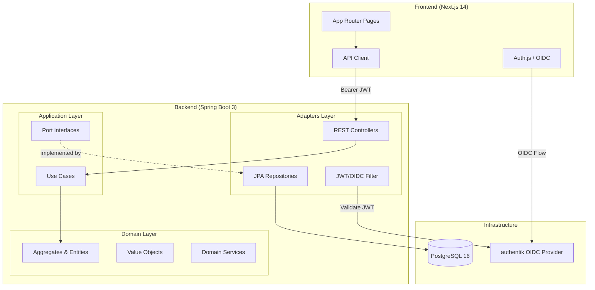
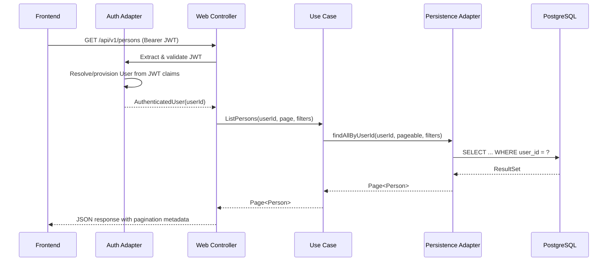
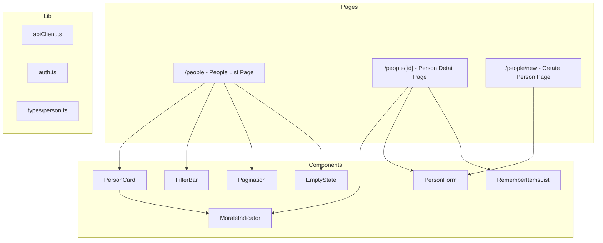
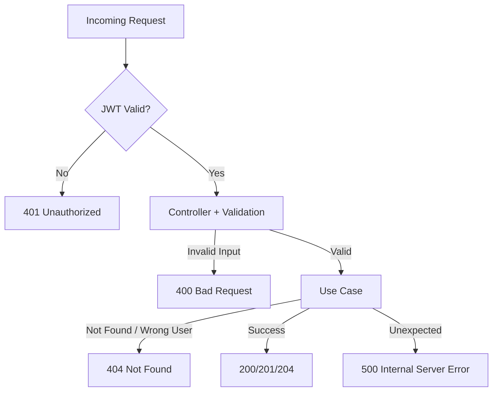

# Design Document: Person Directory

## Overview

The Person Directory is the foundational feature of CrewCaptain, providing managers with a private, isolated directory of people they manage. The system follows a hexagonal/DDD architecture with strict data isolation between managers enforced at every layer.

Key design goals:
- **Data isolation**: Every query is scoped by `userId` — a manager can never access another manager's data
- **Auto-provisioning**: Users (managers) are automatically created on first authenticated request via OIDC JWT claims
- **Domain purity**: The domain layer has zero framework dependencies
- **Full-stack**: Kotlin Spring Boot REST API + Next.js frontend with Auth.js

The feature encompasses: User auto-provisioning, Person CRUD, morale tracking, pinned remember items, paginated/filtered listing, database migrations, REST API, and frontend pages.

## Architecture

### High-Level System Architecture



### Request Flow



### Dependency Direction

```
Adapters (web, persistence, auth) → Application (use cases, ports) → Domain (aggregates, VOs)
```

The domain layer has ZERO framework dependencies. The application layer defines port interfaces that adapters implement.

## Components and Interfaces

### Domain Layer

#### Aggregates

**Person** (Aggregate Root)
- Owns its morale status and pinned remember items
- Enforces invariants: name must be non-empty, morale must be a valid enum value
- Contains business logic for morale updates and remember item management

**User** (Aggregate Root)
- Represents a manager account
- Identified by OIDC subject + issuer combination
- Auto-provisioned on first authenticated request

#### Value Objects

| Value Object | Fields | Constraints |
|---|---|---|
| `UserId` | `value: UUID` | Non-null |
| `PersonId` | `value: UUID` | Non-null |
| `RememberItemId` | `value: UUID` | Non-null |
| `MoraleStatus` | enum: `GREEN, YELLOW, RED, UNKNOWN` | Restricted values |
| `OidcIdentity` | `subject: String, issuer: String` | Both non-empty |

#### Domain Entities

**PinnedRememberItem** (Entity within Person aggregate)
- `id: RememberItemId`
- `text: String` (non-empty)
- `displayOrder: Int`
- `createdAt: Instant`

### Application Layer

#### Use Cases (Commands)

| Use Case | Input | Output | Description |
|---|---|---|---|
| `CreatePersonUseCase` | `CreatePersonCommand(userId, name, preferredName?, roleTitle?, timezone?, startDate?, email?, tags?)` | `Person` | Creates a new Person for the authenticated user |
| `UpdatePersonUseCase` | `UpdatePersonCommand(userId, personId, name, preferredName?, roleTitle?, timezone?, startDate?, email?, tags?)` | `Person` | Updates an existing Person |
| `DeletePersonUseCase` | `DeletePersonCommand(userId, personId)` | `Unit` | Deletes a Person |
| `SetMoraleUseCase` | `SetMoraleCommand(userId, personId, status, note?)` | `Person` | Updates morale status and optional note |
| `AddRememberItemUseCase` | `AddRememberItemCommand(userId, personId, text)` | `List<PinnedRememberItem>` | Adds a pinned remember item |
| `RemoveRememberItemUseCase` | `RemoveRememberItemCommand(userId, personId, itemId)` | `List<PinnedRememberItem>` | Removes a pinned remember item |
| `ReorderRememberItemsUseCase` | `ReorderRememberItemsCommand(userId, personId, orderedIds)` | `List<PinnedRememberItem>` | Reorders pinned remember items |

#### Use Cases (Queries)

| Use Case | Input | Output | Description |
|---|---|---|---|
| `GetPersonUseCase` | `GetPersonQuery(userId, personId)` | `Person?` | Retrieves a single Person |
| `ListPersonsUseCase` | `ListPersonsQuery(userId, page, size, tagFilter?, moraleFilter?)` | `Page<Person>` | Lists Persons with pagination and filters |

#### Ports (Interfaces)

```kotlin
// Outbound port — defined in application layer, implemented by persistence adapter
interface PersonRepository {
    fun save(person: Person): Person
    fun findByIdAndUserId(personId: PersonId, userId: UserId): Person?
    fun findAllByUserId(userId: UserId, pageable: Pageable, tagFilter: String?, moraleFilter: MoraleStatus?): Page<Person>
    fun deleteByIdAndUserId(personId: PersonId, userId: UserId): Boolean
}

interface UserRepository {
    fun findByOidcIdentity(oidcIdentity: OidcIdentity): User?
    fun save(user: User): User
}
```

```kotlin
// Inbound port — defined in application layer, called by web adapter
interface PersonCommandPort {
    fun createPerson(command: CreatePersonCommand): Person
    fun updatePerson(command: UpdatePersonCommand): Person
    fun deletePerson(command: DeletePersonCommand)
    fun setMorale(command: SetMoraleCommand): Person
    fun addRememberItem(command: AddRememberItemCommand): List<PinnedRememberItem>
    fun removeRememberItem(command: RemoveRememberItemCommand): List<PinnedRememberItem>
    fun reorderRememberItems(command: ReorderRememberItemsCommand): List<PinnedRememberItem>
}

interface PersonQueryPort {
    fun getPerson(query: GetPersonQuery): Person
    fun listPersons(query: ListPersonsQuery): Page<Person>
}
```

### Adapter Layer

#### Web Adapter (REST Controllers)

**PersonController** — handles all `/api/v1/persons/**` endpoints
- Extracts `userId` from the security context (populated by auth adapter)
- Delegates to use case ports
- Maps domain objects to response DTOs
- Handles validation errors and maps to standard error format

**Auth Adapter (User Provisioning Filter)**

A Spring Security filter/component that:
1. Extracts JWT claims (subject, issuer, name, email)
2. Looks up or creates the User record (auto-provisioning)
3. Places the resolved `UserId` into the security context for downstream use

#### Persistence Adapter

**JpaPersonRepository** — implements `PersonRepository` port
- Maps between domain `Person` and JPA `PersonEntity`
- All queries include `userId` in WHERE clause

**JpaUserRepository** — implements `UserRepository` port
- Maps between domain `User` and JPA `UserEntity`
- Unique constraint on (oidc_subject, oidc_issuer)

### Frontend Components



## Data Models

### Domain Model

```kotlin
// Domain Aggregate Root
data class Person(
    val id: PersonId,
    val userId: UserId,
    val name: String,
    val preferredName: String?,
    val roleTitle: String?,
    val timezone: String?,
    val startDate: LocalDate?,
    val email: String?,
    val tags: List<String>,
    val moraleStatus: MoraleStatus,
    val moraleNote: String?,
    val pinnedRememberItems: List<PinnedRememberItem>,
    val createdAt: Instant,
    val updatedAt: Instant
) {
    init {
        require(name.isNotBlank()) { "Person name must not be blank" }
    }

    fun updateMorale(status: MoraleStatus, note: String?): Person =
        copy(moraleStatus = status, moraleNote = note, updatedAt = Instant.now())

    fun addRememberItem(text: String): Person { /* ... */ }
    fun removeRememberItem(itemId: RememberItemId): Person { /* ... */ }
    fun reorderRememberItems(orderedIds: List<RememberItemId>): Person { /* ... */ }
}

data class PinnedRememberItem(
    val id: RememberItemId,
    val text: String,
    val displayOrder: Int,
    val createdAt: Instant
) {
    init {
        require(text.isNotBlank()) { "Remember item text must not be blank" }
    }
}

data class User(
    val id: UserId,
    val oidcSubject: String,
    val oidcIssuer: String,
    val displayName: String?,
    val email: String?,
    val createdAt: Instant,
    val updatedAt: Instant
)

enum class MoraleStatus {
    GREEN, YELLOW, RED, UNKNOWN
}
```

### Database Schema

```sql
-- V20250508120000__create_users_table.sql
CREATE TABLE users (
    id UUID PRIMARY KEY DEFAULT gen_random_uuid(),
    oidc_subject VARCHAR(255) NOT NULL,
    oidc_issuer VARCHAR(512) NOT NULL,
    display_name VARCHAR(255),
    email VARCHAR(255),
    created_at TIMESTAMP WITH TIME ZONE NOT NULL DEFAULT NOW(),
    updated_at TIMESTAMP WITH TIME ZONE NOT NULL DEFAULT NOW(),
    CONSTRAINT uq_users_oidc UNIQUE (oidc_subject, oidc_issuer)
);

-- V20250508120001__create_persons_table.sql
CREATE TABLE persons (
    id UUID PRIMARY KEY DEFAULT gen_random_uuid(),
    user_id UUID NOT NULL REFERENCES users(id) ON DELETE CASCADE,
    name VARCHAR(255) NOT NULL,
    preferred_name VARCHAR(255),
    role_title VARCHAR(255),
    timezone VARCHAR(100),
    start_date DATE,
    email VARCHAR(255),
    tags TEXT[] DEFAULT '{}',
    morale_status VARCHAR(20) NOT NULL DEFAULT 'UNKNOWN',
    morale_note TEXT,
    created_at TIMESTAMP WITH TIME ZONE NOT NULL DEFAULT NOW(),
    updated_at TIMESTAMP WITH TIME ZONE NOT NULL DEFAULT NOW()
);

CREATE INDEX idx_persons_user_id ON persons(user_id);
CREATE INDEX idx_persons_morale_status ON persons(user_id, morale_status);

-- V20250508120002__create_pinned_remember_items_table.sql
CREATE TABLE pinned_remember_items (
    id UUID PRIMARY KEY DEFAULT gen_random_uuid(),
    person_id UUID NOT NULL REFERENCES persons(id) ON DELETE CASCADE,
    text TEXT NOT NULL,
    display_order INTEGER NOT NULL DEFAULT 0,
    created_at TIMESTAMP WITH TIME ZONE NOT NULL DEFAULT NOW()
);

CREATE INDEX idx_pinned_remember_items_person_id ON pinned_remember_items(person_id);
```

### API Request/Response Models

#### Create Person
```
POST /api/v1/persons
```
Request:
```json
{
  "name": "Jane Smith",
  "preferredName": "Jane",
  "roleTitle": "Senior Engineer",
  "timezone": "Europe/Berlin",
  "startDate": "2024-03-15",
  "email": "jane@example.com",
  "tags": ["engineering", "senior"]
}
```
Response (201 Created):
```json
{
  "id": "550e8400-e29b-41d4-a716-446655440000",
  "name": "Jane Smith",
  "preferredName": "Jane",
  "roleTitle": "Senior Engineer",
  "timezone": "Europe/Berlin",
  "startDate": "2024-03-15",
  "email": "jane@example.com",
  "tags": ["engineering", "senior"],
  "moraleStatus": "UNKNOWN",
  "moraleNote": null,
  "pinnedRememberItems": [],
  "atAGlance": {
    "last1on1Date": null,
    "openActionItemsCount": null,
    "activePdpGoalsSummary": null
  },
  "createdAt": "2025-05-08T12:00:00Z",
  "updatedAt": "2025-05-08T12:00:00Z"
}
```

#### List Persons
```
GET /api/v1/persons?page=0&size=20&tag=engineering&morale=GREEN
```
Response (200 OK):
```json
{
  "content": [ /* Person objects */ ],
  "page": 0,
  "size": 20,
  "totalElements": 42,
  "totalPages": 3
}
```

#### Update Morale
```
PUT /api/v1/persons/{id}/morale
```
Request:
```json
{
  "status": "GREEN",
  "note": "Had a great sprint review"
}
```

#### Add Remember Item
```
POST /api/v1/persons/{id}/remember-items
```
Request:
```json
{
  "text": "Prefers async communication"
}
```
Response (201 Created):
```json
[
  { "id": "...", "text": "Prefers async communication", "displayOrder": 0, "createdAt": "..." }
]
```

#### Reorder Remember Items
```
PUT /api/v1/persons/{id}/remember-items/reorder
```
Request:
```json
{
  "orderedIds": ["uuid-1", "uuid-3", "uuid-2"]
}
```

#### Error Response Format
```json
{
  "status": 400,
  "error": "Bad Request",
  "message": "Name must not be blank",
  "timestamp": "2025-05-08T12:00:00Z"
}
```


## Correctness Properties

*A property is a characteristic or behavior that should hold true across all valid executions of a system — essentially, a formal statement about what the system should do. Properties serve as the bridge between human-readable specifications and machine-verifiable correctness guarantees.*

### Property 1: User provisioning idempotence

*For any* valid set of OIDC claims (subject, issuer, displayName, email), provisioning a user with those claims multiple times SHALL always return the same User record and never create duplicates.

**Validates: Requirements 1.1, 1.2, 1.3**

### Property 2: Person creation round-trip

*For any* valid Person creation request (non-blank name, any combination of optional fields), creating the Person and then retrieving it by ID SHALL return a Person with all fields matching the original input, a non-null generated UUID, moraleStatus of UNKNOWN, and an empty pinnedRememberItems list.

**Validates: Requirements 2.1, 2.3, 2.4, 2.6, 2.7, 3.1**

### Property 3: Blank name rejection

*For any* string composed entirely of whitespace (including empty string), attempting to create or update a Person with that string as the name SHALL be rejected with a 400 Bad Request response, and the system state SHALL remain unchanged.

**Validates: Requirements 2.2, 2.5, 4.3, 4.5**

### Property 4: Person update preserves identity and reflects changes

*For any* existing Person and any valid update request (non-blank name, any combination of optional fields), updating the Person SHALL return a Person with the same ID and userId but with all mutable fields reflecting the new values provided.

**Validates: Requirements 4.1, 4.2, 4.6**

### Property 5: Delete then retrieval returns not found

*For any* Person belonging to the authenticated User, after successful deletion, retrieving that Person by ID SHALL return a 404 Not Found response.

**Validates: Requirements 5.1, 5.4**

### Property 6: Data isolation across users

*For any* two distinct Users (A and B) and any Person belonging to User A, User B attempting to retrieve, update, delete, set morale, or manage remember items for that Person SHALL receive a 404 Not Found response. Additionally, listing Persons as User B SHALL never include User A's Persons.

**Validates: Requirements 3.2, 3.3, 4.4, 5.2, 5.3, 6.4, 8.5, 9.5, 12.4, 12.5**

### Property 7: Pagination metadata correctness

*For any* User with N Persons and any valid page size S, the list endpoint SHALL return totalElements equal to N, totalPages equal to ceil(N/S), and the content array size SHALL be min(S, N - page*S) for valid page numbers.

**Validates: Requirements 6.1, 6.2, 6.3**

### Property 8: Default alphabetical sort order

*For any* User with multiple Persons, the list endpoint without explicit sort parameters SHALL return Persons ordered alphabetically by name (case-insensitive).

**Validates: Requirements 6.5**

### Property 9: Filter correctness

*For any* User with Persons having various tags and morale statuses, filtering by tag SHALL return only Persons containing that tag, filtering by morale SHALL return only Persons with that status, and filtering by both SHALL return only Persons satisfying both criteria simultaneously.

**Validates: Requirements 7.1, 7.2, 7.3**

### Property 10: Morale status update round-trip

*For any* Person and any valid MoraleStatus value (GREEN, YELLOW, RED, UNKNOWN) with an optional note string, setting the morale SHALL result in the Person's moraleStatus and moraleNote reflecting the provided values when subsequently retrieved.

**Validates: Requirements 8.1, 8.2, 8.3, 8.6**

### Property 11: Remember item addition preserves order and content

*For any* Person and any sequence of non-blank text strings added as remember items, the resulting pinned remember items list SHALL contain all added items in insertion order, with each item's text matching the input exactly.

**Validates: Requirements 9.1, 9.4**

### Property 12: Remember item removal

*For any* Person with N pinned remember items and any valid item ID from that list, removing the item SHALL result in a list of N-1 items where the removed item is no longer present and all other items retain their relative order.

**Validates: Requirements 9.2**

### Property 13: Remember item reorder is a permutation

*For any* Person with pinned remember items and any valid permutation of their IDs, reordering SHALL result in the items appearing in the specified order with no items added or removed (the set of items is unchanged, only displayOrder changes).

**Validates: Requirements 9.3**

### Property 14: Invalid morale status rejection

*For any* string that is not one of GREEN, YELLOW, RED, or UNKNOWN, providing it as a morale status value (in filter or set-morale request) SHALL result in a 400 Bad Request response.

**Validates: Requirements 7.4, 7.5, 8.4**

### Property 15: Authentication required on all endpoints

*For any* API endpoint under /api/v1/, a request without a valid JWT Bearer token SHALL receive a 401 Unauthorized response.

**Validates: Requirements 11.10, 12.1, 12.2**

### Property 16: Error response format consistency

*For any* API request that results in an error (4xx or 5xx), the response body SHALL contain the fields: status (integer), error (string), message (string), and timestamp (ISO 8601 string).

**Validates: Requirements 11.11**

## Error Handling

### Error Response Strategy

All errors follow a consistent JSON format:

```json
{
  "status": 400,
  "error": "Bad Request",
  "message": "Human-readable description",
  "timestamp": "2025-05-08T12:00:00Z"
}
```

### Error Categories

| HTTP Status | Condition | Example |
|---|---|---|
| 400 Bad Request | Validation failure | Blank name, invalid morale value, empty remember item text |
| 401 Unauthorized | Missing or invalid JWT | No Authorization header, expired token, invalid signature |
| 404 Not Found | Resource not found OR belongs to another user | Non-existent person ID, cross-user access attempt |
| 500 Internal Server Error | Unexpected server error | Database connection failure, unhandled exception |

### Design Decisions

1. **404 over 403 for cross-user access**: When a manager requests another manager's resource, the system returns 404 (not 403) to avoid confirming the resource exists. This is a security-by-obscurity measure that prevents enumeration attacks.

2. **Validation at multiple layers**:
   - Domain layer: `require()` checks in constructors enforce invariants (name not blank, valid morale enum)
   - Application layer: Use cases validate business rules before delegating to domain
   - Web adapter: `@Valid` + Bean Validation annotations on request DTOs provide early rejection with descriptive messages

3. **Global exception handler**: A `@RestControllerAdvice` class catches all exceptions and maps them to the standard error format:
   - `MethodArgumentNotValidException` → 400
   - `PersonNotFoundException` → 404
   - `AccessDeniedException` → 401
   - All others → 500 (with generic message, no internal details leaked)

### Error Handling Flow



## Testing Strategy

### Testing Layers

| Layer | Test Type | Framework | Focus |
|---|---|---|---|
| Domain | Unit tests | JUnit 5 + Kotest assertions | Aggregate invariants, value object validation, domain logic |
| Application | Unit tests + Property tests | JUnit 5 + Mockk + Kotest property testing | Use case correctness, port interactions |
| Web Adapter | Slice tests | `@WebMvcTest` + MockMvc + Spring Security Test | Request/response mapping, validation, auth |
| Persistence | Integration tests | Testcontainers + JUnit 5 | Query correctness, userId scoping, migrations |
| Full Stack | Integration tests | Testcontainers + full Spring context | End-to-end request flows |
| Frontend Components | Unit tests | Jest + React Testing Library | Rendering, interactions, state |
| Frontend E2E | E2E tests | Playwright | Critical user flows |

### Property-Based Testing Configuration

**Library**: Kotest property testing (`io.kotest:kotest-property:5.8.1`)

**Configuration**:
- Minimum 100 iterations per property test
- Custom generators for domain objects (Person, User, MoraleStatus, etc.)
- Each property test tagged with design document reference

**Tag format**: `Feature: person-directory, Property {number}: {property_text}`

### Dual Testing Approach

- **Unit tests** cover: specific examples, edge cases (empty strings, null fields, boundary values), error conditions, integration points between components
- **Property tests** cover: universal properties across all valid inputs (Properties 1-16 from Correctness Properties section), comprehensive input coverage through randomization

### Test Organization

```
api/src/test/kotlin/com/peoplemanager/
├── domain/
│   ├── PersonTest.kt              — Aggregate invariants (Properties 3, 11, 12, 13)
│   ├── PinnedRememberItemTest.kt  — Value object validation
│   ├── UserTest.kt                — User aggregate tests
│   └── MoraleStatusTest.kt        — Enum validation
├── application/
│   ├── CreatePersonUseCaseTest.kt — Property 2, 3
│   ├── UpdatePersonUseCaseTest.kt — Property 4
│   ├── DeletePersonUseCaseTest.kt — Property 5
│   ├── ListPersonsUseCaseTest.kt  — Properties 7, 8, 9
│   ├── SetMoraleUseCaseTest.kt    — Properties 10, 14
│   ├── RememberItemUseCaseTest.kt — Properties 11, 12, 13
│   └── UserProvisioningTest.kt    — Property 1
├── adapters/web/
│   ├── PersonControllerTest.kt    — Properties 15, 16, endpoint tests
│   └── SecurityIntegrationTest.kt — Properties 6, 15
└── integration/
    ├── PersonRepositoryTest.kt    — Persistence correctness, userId scoping
    ├── UserRepositoryTest.kt      — Unique constraint, provisioning
    └── FlywayMigrationTest.kt     — Schema smoke tests
```

### Frontend Test Organization

```
frontend/
├── __tests__/
│   ├── components/
│   │   ├── PersonCard.test.tsx
│   │   ├── MoraleIndicator.test.tsx
│   │   ├── FilterBar.test.tsx
│   │   ├── PersonForm.test.tsx
│   │   ├── RememberItemsList.test.tsx
│   │   └── EmptyState.test.tsx
│   └── pages/
│       ├── PeopleListPage.test.tsx
│       └── PersonDetailPage.test.tsx
└── e2e/
    ├── people-list.spec.ts
    └── person-detail.spec.ts
```

### Security-Critical Tests (Non-Negotiable)

These tests MUST exist and pass before the feature is considered complete:

1. A manager cannot read another manager's Person records (Property 6)
2. All list endpoints return only the authenticated manager's data (Property 6)
3. Unauthenticated requests to any `/api/v1/**` endpoint return 401 (Property 15)
4. Cross-manager access returns 404, not 403 (Property 6)
5. UserId scoping is enforced at both use case AND persistence layer (Property 6)
