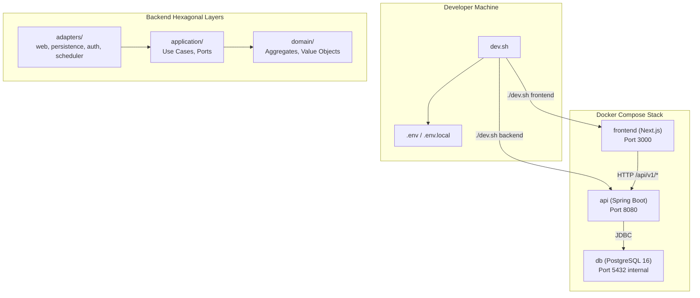
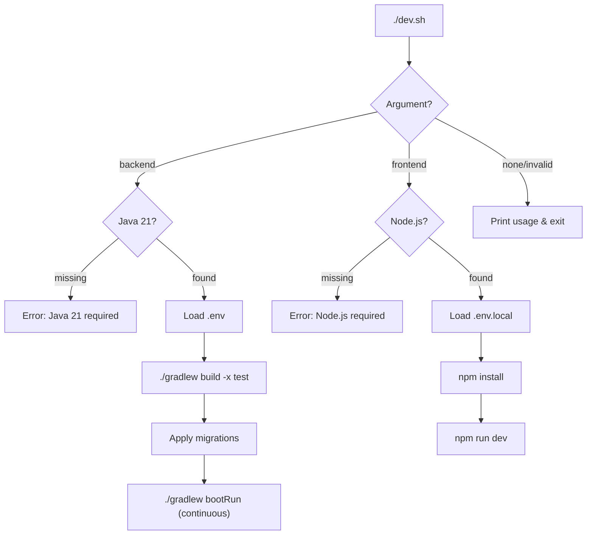

# Design Document: Project Boilerplate

## Overview

This design defines the technical implementation for the CrewCaptain project boilerplate — the foundational folder structure, build configuration, containerization, and local development tooling. The boilerplate establishes a Kotlin Spring Boot 3 backend (Hexagonal/DDD) and a React Next.js frontend with Auth.js, connected via Docker Compose with PostgreSQL 16.

The goal is a "clone and go" developer experience: after cloning the repo and configuring `.env`, developers can run `./dev.sh backend` or `./dev.sh frontend` for local development, or `docker compose up` for a production-like stack.

### Key Design Decisions

| Decision | Rationale |
|----------|-----------|
| Gradle Kotlin DSL | Type-safe build scripts, better IDE support for Kotlin projects |
| Multi-stage Docker builds | Minimal production images, faster CI caching |
| `dev.sh` as primary local runner | Single entry point, handles deps + migrations + hot-reload |
| Docker Compose override for local dev | Separates prod config from dev conveniences (volume mounts, exposed ports) |
| Non-root container users | Security best practice for production containers |
| Flyway for migrations | Versioned, repeatable schema management with Spring Boot integration |
| Testcontainers (no H2) | Tests run against real PostgreSQL, matching production behavior |

---

## Architecture



### File System Layout

```
/
├── AGENTS.md
├── README.md
├── PROGRESS.md
├── DESIGN.md
├── dev.sh                          ← Executable bash script
├── docker-compose.yml              ← Production-like stack
├── docker-compose.override.yml     ← Local dev overrides (gitignored)
├── .env.example                    ← Documented env var template
├── .gitignore
│
├── api/
│   ├── build.gradle.kts
│   ├── settings.gradle.kts
│   ├── gradle.properties
│   ├── gradlew / gradlew.bat
│   ├── gradle/wrapper/
│   ├── Dockerfile
│   └── src/
│       ├── main/
│       │   ├── kotlin/com/peoplemanager/
│       │   │   ├── PeopleManagerApplication.kt
│       │   │   ├── domain/
│       │   │   │   └── .gitkeep
│       │   │   ├── application/
│       │   │   │   └── .gitkeep
│       │   │   └── adapters/
│       │   │       ├── web/
│       │   │       │   └── .gitkeep
│       │   │       ├── persistence/
│       │   │       │   └── .gitkeep
│       │   │       ├── auth/
│       │   │       │   └── .gitkeep
│       │   │       └── scheduler/
│       │   │           └── .gitkeep
│       │   └── resources/
│       │       └── application.yml
│       └── test/
│           └── kotlin/com/peoplemanager/
│               ├── domain/
│               │   └── .gitkeep
│               ├── application/
│               │   └── .gitkeep
│               ├── adapters/
│               │   └── web/
│               │       └── .gitkeep
│               └── integration/
│                   └── .gitkeep
│
└── frontend/
    ├── package.json
    ├── tsconfig.json
    ├── next.config.ts
    ├── Dockerfile
    ├── src/
    │   ├── app/
    │   │   ├── layout.tsx
    │   │   └── page.tsx
    │   ├── components/
    │   │   └── .gitkeep
    │   ├── lib/
    │   │   └── .gitkeep
    │   └── types/
    │       └── .gitkeep
    ├── __tests__/
    │   └── .gitkeep
    └── e2e/
        └── .gitkeep
```

---

## Components and Interfaces

### 1. Backend Build Configuration (`api/build.gradle.kts`)

**Purpose**: Define all backend dependencies, plugins, and build tasks.

**Key dependencies**:
- `org.springframework.boot:spring-boot-starter-web` — REST API
- `org.springframework.boot:spring-boot-starter-data-jpa` — Persistence
- `org.springframework.boot:spring-boot-starter-security` — Security
- `org.springframework.boot:spring-boot-starter-oauth2-resource-server` — OIDC/JWT
- `org.springframework.boot:spring-boot-starter-validation` — Bean Validation
- `org.flywaydb:flyway-core` + `flyway-database-postgresql` — Migrations
- `org.postgresql:postgresql` — JDBC driver
- `com.fasterxml.jackson.module:jackson-module-kotlin` — JSON serialization

**Test dependencies**:
- `org.springframework.boot:spring-boot-starter-test`
- `org.springframework.security:spring-security-test`
- `org.testcontainers:postgresql` + `org.testcontainers:junit-jupiter`
- `io.mockk:mockk` — Mocking
- `io.kotest:kotest-assertions-core` — Assertions

**Plugins**:
- `org.springframework.boot` (3.3.x)
- `io.spring.dependency-management`
- `org.jetbrains.kotlin.jvm`
- `org.jetbrains.kotlin.plugin.spring`
- `org.jetbrains.kotlin.plugin.jpa`

**Kotlin/JVM target**: 21

### 2. Backend Application Entry Point

```kotlin
// api/src/main/kotlin/com/peoplemanager/PeopleManagerApplication.kt
package com.peoplemanager

import org.springframework.boot.autoconfigure.SpringBootApplication
import org.springframework.boot.runApplication

@SpringBootApplication
class PeopleManagerApplication

fun main(args: Array<String>) {
    runApplication<PeopleManagerApplication>(*args)
}
```

### 3. Backend Configuration (`application.yml`)

```yaml
spring:
  datasource:
    url: ${DB_URL}
    username: ${DB_USER}
    password: ${DB_PASSWORD}
  jpa:
    hibernate:
      ddl-auto: validate
    open-in-view: false
  flyway:
    enabled: true
  security:
    oauth2:
      resourceserver:
        jwt:
          issuer-uri: ${OIDC_ISSUER_URI}
          jwk-set-uri: ${OIDC_JWKS_URI}

server:
  port: 8080
```

**Design decisions**:
- `ddl-auto: validate` — Flyway manages schema; Hibernate only validates
- `open-in-view: false` — Prevents lazy loading in controllers (hexagonal boundary enforcement)
- Environment variables referenced directly via `${}` Spring property placeholders

### 4. Frontend Configuration

**`package.json`** key dependencies:
- `next` (14.x) — App Router framework
- `react`, `react-dom` (18.x)
- `next-auth` (5.x / Auth.js) — OIDC authentication
- `typescript` (5.x)

**Dev dependencies**:
- `@types/react`, `@types/node`
- `jest`, `@testing-library/react`, `@testing-library/jest-dom`
- `@playwright/test`
- `eslint`, `eslint-config-next`

**`tsconfig.json`**: Strict mode enabled, path aliases (`@/` → `src/`).

**`next.config.ts`**: Output standalone for Docker optimization, environment variable passthrough.

### 5. Local Development Script (`dev.sh`)



**Implementation details**:
- Shebang: `#!/usr/bin/env bash`
- `set -euo pipefail` for strict error handling
- Loads `.env` from project root (backend) or `.env.local` (frontend)
- Checks for required tools before proceeding
- Backend hot-reload via Spring Boot DevTools + Gradle continuous build
- Frontend hot-reload via Next.js built-in HMR

### 6. Backend Dockerfile (`api/Dockerfile`)

```dockerfile
# Stage 1: Build
FROM gradle:8-jdk21 AS build
WORKDIR /app
COPY build.gradle.kts settings.gradle.kts gradle.properties ./
COPY gradle ./gradle
RUN gradle dependencies --no-daemon || true
COPY src ./src
RUN gradle bootJar --no-daemon

# Stage 2: Runtime
FROM eclipse-temurin:21-jre-alpine AS runtime
RUN addgroup -S appgroup && adduser -S appuser -G appgroup
WORKDIR /app
COPY --from=build /app/build/libs/*.jar app.jar
USER appuser
EXPOSE 8080
ENTRYPOINT ["java", "-jar", "app.jar"]
```

**Design decisions**:
- Gradle dependency layer cached separately for faster rebuilds
- `eclipse-temurin:21-jre-alpine` — minimal JRE image (~80MB)
- Non-root `appuser` for security
- No build tools in runtime image

### 7. Frontend Dockerfile (`frontend/Dockerfile`)

```dockerfile
# Stage 1: Dependencies
FROM node:20-alpine AS deps
WORKDIR /app
COPY package.json package-lock.json ./
RUN npm ci --only=production

# Stage 2: Build
FROM node:20-alpine AS build
WORKDIR /app
COPY package.json package-lock.json ./
RUN npm ci
COPY . .
RUN npm run build

# Stage 3: Runtime
FROM node:20-alpine AS runtime
RUN addgroup -S appgroup && adduser -S appuser -G appgroup
WORKDIR /app
COPY --from=build /app/.next/standalone ./
COPY --from=build /app/.next/static ./.next/static
COPY --from=build /app/public ./public
USER appuser
EXPOSE 3000
ENV PORT=3000
CMD ["node", "server.js"]
```

**Design decisions**:
- Three-stage build: deps → build → runtime (optimal caching)
- `output: 'standalone'` in next.config.ts enables minimal runtime
- Only production artifacts copied to final image
- Non-root `appuser` for security

### 8. Production Docker Compose (`docker-compose.yml`)

```yaml
services:
  db:
    image: postgres:16
    environment:
      POSTGRES_DB: crewcaptain
      POSTGRES_USER: ${DB_USER:-crewcaptain}
      POSTGRES_PASSWORD: ${DB_PASSWORD:-changeme}
    volumes:
      - pgdata:/var/lib/postgresql/data
    healthcheck:
      test: ["CMD-SHELL", "pg_isready -U ${DB_USER:-crewcaptain}"]
      interval: 5s
      timeout: 3s
      retries: 5
    # Port 5432 NOT exposed to host

  api:
    build: ./api
    ports:
      - "8080:8080"
    environment:
      DB_URL: jdbc:postgresql://db:5432/crewcaptain
      DB_USER: ${DB_USER:-crewcaptain}
      DB_PASSWORD: ${DB_PASSWORD:-changeme}
      OIDC_ISSUER_URI: ${OIDC_ISSUER_URI:-http://localhost:9000/application/o/crewcaptain/}
      OIDC_JWKS_URI: ${OIDC_JWKS_URI:-http://localhost:9000/application/o/crewcaptain/jwks/}
      ENCRYPTION_KEY: ${ENCRYPTION_KEY:-}
    depends_on:
      db:
        condition: service_healthy
    healthcheck:
      test: ["CMD-SHELL", "curl -f http://localhost:8080/actuator/health || exit 1"]
      interval: 10s
      timeout: 5s
      retries: 5

  frontend:
    build: ./frontend
    ports:
      - "3000:3000"
    environment:
      NEXTAUTH_URL: ${NEXTAUTH_URL:-http://localhost:3000}
      NEXTAUTH_SECRET: ${NEXTAUTH_SECRET:-change-me-in-production}
      OIDC_CLIENT_ID: ${OIDC_CLIENT_ID:-crewcaptain}
      OIDC_CLIENT_SECRET: ${OIDC_CLIENT_SECRET:-changeme}
      OIDC_ISSUER: ${OIDC_ISSUER:-http://localhost:9000/application/o/crewcaptain/}
      API_BASE_URL: ${API_BASE_URL:-http://api:8080}
    depends_on:
      api:
        condition: service_healthy

volumes:
  pgdata:
```

**Design decisions**:
- `db` port not exposed to host in production (only internal network)
- Service dependency chain: `db` → `api` → `frontend`
- Health checks ensure services are ready before dependents start
- All env vars have placeholder defaults for documentation clarity
- Named volume `pgdata` for data persistence across restarts

### 9. Local Development Override (`docker-compose.override.yml`)

```yaml
services:
  db:
    ports:
      - "5432:5432"

  api:
    build:
      context: ./api
      target: build
    volumes:
      - ./api/src:/app/src
    environment:
      SPRING_PROFILES_ACTIVE: dev
      SPRING_DEVTOOLS_RESTART_ENABLED: "true"

  frontend:
    volumes:
      - ./frontend/src:/app/src
      - ./frontend/public:/app/public
    environment:
      NODE_ENV: development
    command: ["npm", "run", "dev"]
```

**Design decisions**:
- Exposes PostgreSQL port 5432 to host for direct DB access (DBeaver, psql)
- Mounts source directories for live code reloading
- Sets development profiles/modes
- Overrides frontend command to use dev server instead of production build

### 10. Environment Variable Documentation (`.env.example`)

Structured with section headers and descriptive comments for each variable. Uses clearly fake placeholder values (e.g., `your-oidc-issuer-url-here`) to prevent accidental production use.

---

## Data Models

This feature does not introduce domain data models. It establishes the infrastructure for future domain model implementation. The PostgreSQL 16 database is configured but empty — schema will be created via Flyway migrations in subsequent features.

**Database connection model**:
- JDBC URL format: `jdbc:postgresql://<host>:<port>/<database>`
- Default database name: `crewcaptain`
- Connection pooling: HikariCP (Spring Boot default)

---

## Error Handling

### dev.sh Error Handling

| Condition | Behavior |
|-----------|----------|
| Missing Java 21 | Print error with install instructions, exit 1 |
| Missing Node.js/npm | Print error with install instructions, exit 1 |
| Missing `.env` file | Print warning (not fatal — Spring can use defaults) |
| Gradle build failure | Exit with Gradle's exit code, output preserved |
| npm install failure | Exit with npm's exit code, output preserved |
| Invalid argument | Print usage message, exit 1 |

### Docker Error Handling

| Condition | Behavior |
|-----------|----------|
| DB health check fails | `api` service won't start (depends_on condition) |
| API health check fails | `frontend` service won't start |
| Missing env vars at runtime | Spring Boot fails fast with clear error message |
| Port conflict | Docker Compose reports bind error |

### Build Failures

- Backend: Gradle outputs compilation errors to stderr
- Frontend: Next.js build outputs TypeScript/ESLint errors to stderr
- Docker: Build stage failures stop the pipeline with layer context

---

## Testing Strategy

### Why Property-Based Testing Does NOT Apply

This feature consists entirely of:
- **Infrastructure as Code** (Dockerfiles, Docker Compose)
- **Configuration files** (build.gradle.kts, package.json, tsconfig.json, application.yml)
- **Shell scripting** (dev.sh)
- **Folder structure creation** (directories with .gitkeep files)

None of these have meaningful input variation or pure function behavior. There are no universal properties to test across generated inputs. The appropriate testing strategies are smoke tests, example-based tests, and integration tests.

### Testing Approach

| What to Test | Strategy | Tool |
|--------------|----------|------|
| Backend compiles | Smoke test | `./gradlew build -x test` |
| Spring Boot starts with valid config | Integration test | Testcontainers + JUnit 5 |
| Frontend builds | Smoke test | `npm run build` |
| Docker images build | Smoke test | `docker build` |
| Docker Compose stack starts | Integration test | `docker compose up` + health checks |
| dev.sh usage message | Example-based test | Shell script test |
| dev.sh missing tool detection | Example-based test | Shell script test |
| Folder structure exists | Example-based test | File existence checks |
| application.yml references correct env vars | Example-based test | Config validation |

### Specific Tests to Implement

1. **Backend Application Context Test** — Verifies Spring Boot context loads with Testcontainers PostgreSQL
2. **dev.sh Usage Test** — Verifies script prints usage when called without arguments
3. **dev.sh Dependency Check Test** — Verifies script detects missing tools
4. **Docker Build Tests** — CI pipeline verifies both Dockerfiles build successfully
5. **Compose Health Check Test** — CI pipeline verifies all services reach healthy state

### Test Execution

```bash
# Backend compilation check
cd api && ./gradlew build -x test

# Backend context loads
cd api && ./gradlew test --tests "com.peoplemanager.integration.*"

# Frontend build check
cd frontend && npm run build

# Docker builds
docker build -t crewcaptain-api ./api
docker build -t crewcaptain-frontend ./frontend

# Full stack
docker compose up -d --wait
docker compose ps  # verify all healthy
docker compose down
```
